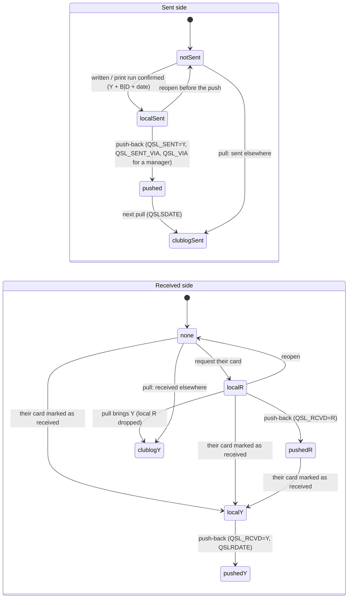

# QSO / QSL states

Every path a QSO and its card can take, as built (2026-10-05). Two things
have state: the **card** (one row in `qsl_work_queue`, keyed by the QSO) and
the **QSL flags** on the QSO (`qsos`: what Clublog last reported plus local
changes not yet pushed). Every card move is one guarded store transition
(`internal/store/store.go`): one transaction for the queue row, the `qsos`
columns and a `qsl_events` row; a move from the wrong state is
`ErrConflict` (HTTP 409, a stale page).

## 1. The card

```mermaid
stateDiagram-v2
    direction LR
    [*] --> queued: new QSO qualifies (UDP, Clublog pull)
    [*] --> decided: reply to their card (never queued)

    queued --> decided: yes, card
    queued --> skipped: no card
    queued --> skipped: backlog (before the cutoff, at startup)
    queued --> sent: written now (B/D; store only, no UI since 2026-10-06)
    queued --> sent: Clublog reports it sent

    decided --> toprint: to print (route + note)
    decided --> sent: written by hand (route)
    decided --> requested: request their card (channel + note)
    decided --> skipped: no card after all
    decided --> queued: back (store only, no UI since 2026-10-06)
    decided --> sent: Clublog reports it sent

    toprint --> printing: print run (all queued cards, one job) / ADIF export for a print service
    toprint --> decided: back to the Desk
    toprint --> sent: Clublog reports it sent

    printing --> printing: print / export ticked again
    printing --> toprint: back to the print queue / job failed
    printing --> sent: all fine (the run, as a whole)

    skipped --> decided: reply to their card
    requested --> decided: reply, once their card arrived

    sent --> queued: reopen
    skipped --> queued: reopen
    requested --> queued: reopen
```

Where the states live in the UI:

| Status | Area | Meaning |
|---|---|---|
| `queued` | New QSOs (Inbox) | card or not? |
| `decided` | Desk | yes, card; route open until written or sent to printing |
| `toprint` | Desk, Print queue view (`/work/printq`, third view in the band, with a live count) | route and note fixed, waits for the next print run |
| `printing` | Desk, Print queue view: "Printed - check the cards" (or "Exported for the print service") | printed - or written into one ADIF file for a QSL print service (`card.export_dir`, default `exports/` next to the database) - in the open run, not yet confirmed; one run at a time |
| `sent` | Done | written or printed (confirmed), or sent per Clublog |
| `skipped` | Done | no card (a decision, or the backlog) |
| `requested` | Done; Incoming QSLs lists it as expected until their card arrives | their card requested (OQRS & co.), no own card |

The contact tracker (QSO in progress, `internal/contact`) makes the same
Inbox moves when the QSO is logged: it enqueues the QSO and then applies yes
(`decided`) or no (`skipped`). "Written now" (Inbox, QSO in progress) and
the Desk's "back to New QSOs" were dropped from the UI on 2026-10-06; their
store transitions remain.

### Transitions

| Store function | From -> to | Trigger | Writes besides the status |
|---|---|---|---|
| `Enqueue` | - -> `queued` | qualifier (UDP, pull, recompute), tracker | `override_reason`; never overwrites an existing row |
| `QueueAccept` | `queued` -> `decided` | Inbox yes, tracker | route cleared |
| `QueueDecline` | `queued` -> `skipped` | Inbox no, tracker | `desired_method=N` |
| `QueueDiscardBacklog` | `queued` -> `skipped` | startup, once per cutoff | `desired_method=N`, `note=backlog`; override-marker QSOs stay |
| `QueueWrittenNow` | `queued` -> `sent` | none since 2026-10-06 (was: Inbox / QSO in progress, written now) | route B/D, `note=written now`; QSO: `qsl_sent_local=Y`, method, date |
| `QueueCloseSentElsewhere` | `queued`/`decided`/`toprint` -> `sent` | pull: the QSO is new or changed and Clublog has it sent | `note=sent elsewhere`; QSO untouched |
| `QueueToPrint` | `decided` -> `toprint` | Desk `p` | route, `card_note` |
| `QueueUnprint` | `toprint` -> `decided` | print queue: back to the Desk | route and note kept as preselection |
| `QueueStartRun` | all `toprint` -> `printing` | print queue: Print, or Export ADIF | `printed_at`; refused while a run is open or nothing is queued; meta `print_run_export` = the run's ADIF file ("" = printed) |
| `QueueRunFailed` | `printing` -> `toprint` | the run's job failed (render or printer) | - |
| `QueueReprint` | `printing` -> `printing` | Print / Export ticked again | `printed_at` |
| `QueueRunBack` | `printing` -> `toprint` | Ticked back to the print queue | - |
| `QueueConfirmRun` | all `printing` -> `sent` | All fine - sent | QSO: `qsl_sent_local=Y`, `qsl_sent_method_local`=B/D, date |
| `QueueWritten` | `decided` -> `sent` | Desk `w` | route; QSO sent state |
| `QueueRequested` | `decided` -> `requested` | Desk `r` | `desired_method=R`, channel, note, `sent_at`; QSO: `qsl_rcvd_local=R` unless R/Y already |
| `QueueDeskDecline` | `decided` -> `skipped` | Desk `n` | `desired_method=N` |
| `QueueBack` | `decided` -> `queued` | none since 2026-10-06 (was: Desk `u` / batch) | route cleared |
| `QueueReply` | none/`queued`/`skipped`/`requested`(card arrived) -> `decided`; `decided` stays | Incoming QSLs: later at the Desk | new row: `override_reason=reply to their card` |
| `QueueReplyFinish` | as `QueueReply`, then -> `sent` (written) or `toprint` | Incoming QSLs: written / to print | one transaction |
| `QueueReopen` | `sent`/`skipped`/`requested` -> `queued` | Done: Reopen | clears route, note, dates; local sent/requested state cleared |

## 2. The QSL flags on the QSO

Clublog columns (`qsl_sent`, `qslsdate`, `qsl_rcvd`, `qslrdate`, `qsl_sent_as`)
mirror the last pull; the `_local` columns hold what qslotter changed and has
not pushed. "Sent per log" (`QSO.SentPerLog`) is `QSL_SENT=Y` or a
`QSLSDATE`: Clublog's export never carries `QSL_SENT`.



Rules: a local R is never set over a received card or over R in Clublog, and
is dropped when a pull brings Y; a print queue or an open run pushes nothing
(only the confirmation sets the sent state); "no card" pushes nothing.

## 3. Known gaps (not fixed, by decision)

- **A "no card" QSO that Clublog later reports as sent stays "no card".** The
  pull's "sent elsewhere" close covers `queued`, `decided` and `toprint` only.
- **Reopen cannot undo what Clublog holds.** Nothing pushes `QSL_SENT=N` or
  clears `QSL_RCVD=R`; the UI says so. A reopened card whose QSO still shows a
  `QSLSDATE` is closed again as "sent elsewhere" by the next pull that brings
  a changed record.
- **Reopen during a push in flight:** `MarkPushed` copies only values still
  matching the snapshot, so the local mirror may say "not sent" while Clublog
  has it, until the next pull with a changed record.
- **`qsl_events` is write-only:** recorded for every move, read nowhere yet.
- **Their card on a request does not change the queue status:** it stays
  `requested` (Done says "received"); Incoming QSLs offers "Your card to the
  Desk" when you want to send yours anyway.
